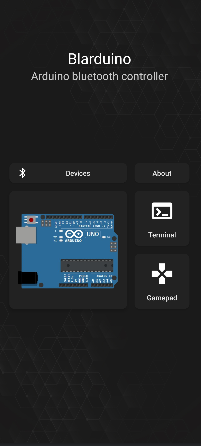
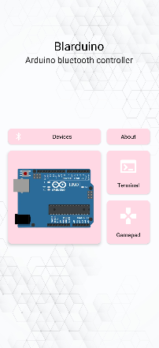

<h1  align="center">Blarduino</h1>

Arduino bluetooth controller

***

  </img>
  </img> 

## Description

Android application that enables a custom bluetooth communication. 
It has a terminal mode, where the user can type any commands, and a gamepad mode
with custom actions for each control.

*Tested with a HC-05 bluetooth module, but it should work with any bluetooth module*